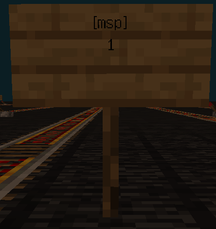
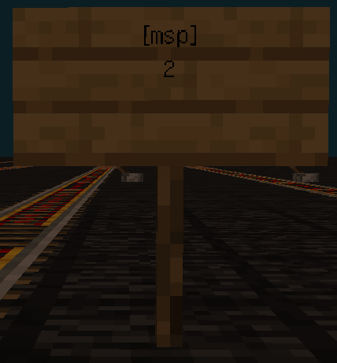
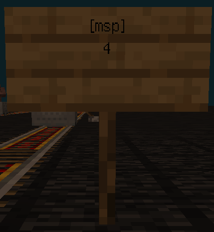
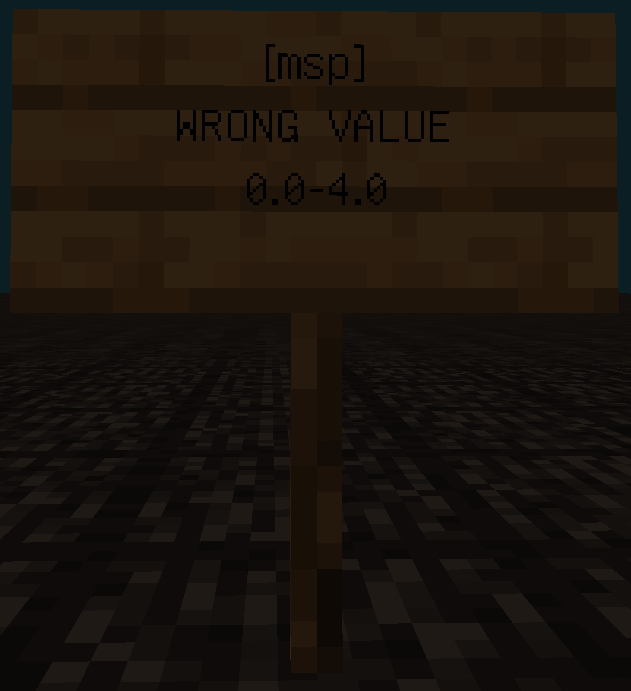

# Image:

* set maxspeed dynamically

  
   
  
   

* set maxspeed globally

   
   

* automatically slowdown

   
  if value = null  
  —>
   

* gliding minecarts

  [msp]->fly,[msp]->nofly

# Description

* [Why only four times the maxspeed can be set](https://www.spigotmc.org/threads/increasing-max-speed-of-minecarts.654689),I don't know either.